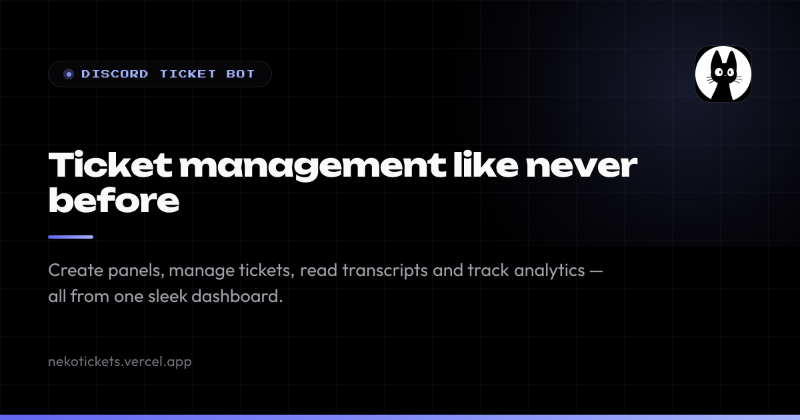
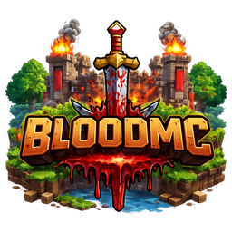

# Manav Dhakate

Full-Stack Developer — web applications, Discord bots & game infrastructure

---

## About

I build and ship complete web products — not isolated features. My core stack is
JavaScript and TypeScript: React and Next.js on the front end, Node.js and
Express behind it, MongoDB and MySQL for data. I also build Discord bots end to
end and work on the web and infrastructure side of a live Minecraft network.

I care about the parts users actually feel — fast pages, clear interfaces, and
code the next developer can pick up without a walkthrough.

> Currently learning Python, moving toward backend automation.

## Projects

### NekoTickets — Discord ticket platform

A Discord ticket bot paired with a Next.js web dashboard. Staff open support
panels directly inside Discord, then manage every ticket, read transcripts, and
track response analytics from the dashboard.

`Next.js` · `Node.js` · `Discord.js` · `Web Dashboard`

**[nekotickets.vercel.app](https://nekotickets.vercel.app)**

### BloodMC — Minecraft network

A competitive Minecraft network with Bedwars, Lifesteal SMP, FFA and Skyblock,
cross-play across Java and Bedrock editions, and a 300+ member community. I work
on the web platform and server infrastructure behind it.

`Web Platform` · `Infrastructure` · `Community`

**[bloodmc.net](https://bloodmc.net)**

## Stack

| Area | Tools |
| --- | --- |
| Languages | JavaScript · TypeScript · Python (learning) |
| Frontend | React · Next.js · Tailwind CSS |
| Backend | Node.js · Express |
| Data | MongoDB · MySQL · Redis · Firebase |
| Bots | Discord.js |
| Tooling | Git · Docker · Vercel · GitHub Actions |

## Contact

Open to full-time roles and freelance projects.

[GitHub](https://github.com/ManavEquinox) · [CodersPlanetDevs](https://github.com/CodersPlanetDevs) · [dhakatemanav2@gmail.com](mailto:dhakatemanav2@gmail.com)
